# Overall Project Structure & Workflow

This document provides a comprehensive overview of the project structure, entry points, and workflow logic.

## 📁 Project Overview

This project provisions **Ubuntu VMs with GUI (RDP + XFCE)** on AWS/GCP using Terraform/Terragrunt, and installs a complete development toolchain.

## 🗂️ Directory Structure

```
cloud_ubuntu_gui_iac_aws_gcp/
├── infra/                    # Infrastructure as Code
│   ├── aws/
│   │   ├── terraform/        # Terraform modules
│   │   └── terragrunt/       # Terragrunt configuration
│   └── gcp/
│       ├── terraform/        # Terraform modules
│       └── terragrunt/       # Terragrunt configuration
│
├── scripts/                   # All automation scripts
│   ├── core/                 # Core infrastructure operations
│   │   ├── setup.sh         # Provision infrastructure
│   │   ├── teardown.sh      # Destroy infrastructure
│   │   └── lib/              # Core libraries
│   │
│   ├── providers/            # Provider-specific modules
│   │   ├── aws/
│   │   │   ├── config.sh     # Terraform variable mappings
│   │   │   ├── constants.sh  # AWS-specific constants
│   │   │   └── functions.sh  # AWS-specific functions
│   │   └── gcp/              # (same structure)
│   │
│   ├── vm/                   # VM lifecycle management
│   │   ├── lifecycle/        # VM lifecycle operations
│   │   │   ├── show-access-info.sh
│   │   │   └── lib/
│   │   │       └── vm_common.sh  # Provider-agnostic wrappers
│   │   ├── install/          # Post-provisioning installation
│   │   │   ├── tools/        # Host-side installation scripts
│   │   │   ├── remoteside/   # Remote scripts (executed on VM)
│   │   │   └── lib/          # Installation utilities
│   │   └── monitor/          # VM monitoring
│   │       ├── monitor-installation.sh
│   │       └── monitor-teardown.sh
│   │
│   ├── orchestration/        # High-level workflows
│   │   ├── setup-full.sh     # Full automated setup
│   │   └── teardown-full.sh  # Full automated teardown
│   │
│   └── tools/                 # Utility tools
│       └── env/              # Environment variable management
│
├── .env.example              # Environment variable template
└── README.md                 # Quick start guide
```

## 🚀 Entry Points

### Primary Entry Points (Most Common)

```bash
# Full automated setup
./scripts/orchestration/setup-full.sh aws

# Full automated teardown
./scripts/orchestration/teardown-full.sh aws
```

### Secondary Entry Points (Manual Control)

```bash
# Infrastructure only
./scripts/core/setup.sh aws
./scripts/core/teardown.sh aws

# VM operations (after infrastructure is running)
./scripts/vm/lifecycle/show-access-info.sh aws
./scripts/vm/monitor/monitor-installation.sh aws
./scripts/vm/install/tools/install-vm-tools-nonnode.sh aws
```

> **See [ENTRY_POINTS.md](ENTRY_POINTS.md) for complete entry point documentation**

## 🔄 Workflow Overview

### Setup Workflow

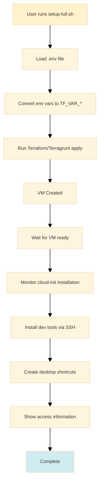

### Teardown Workflow

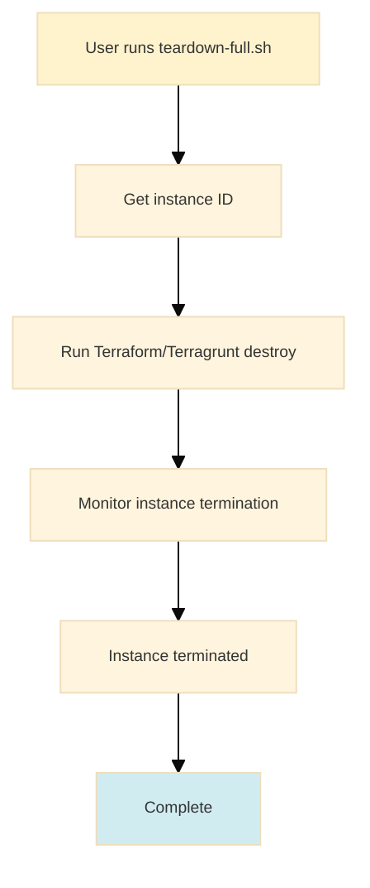

## 🏗️ Architecture Layers

### Layer 1: Core Infrastructure (`scripts/core/`)

**Purpose**: Terraform/Terragrunt operations

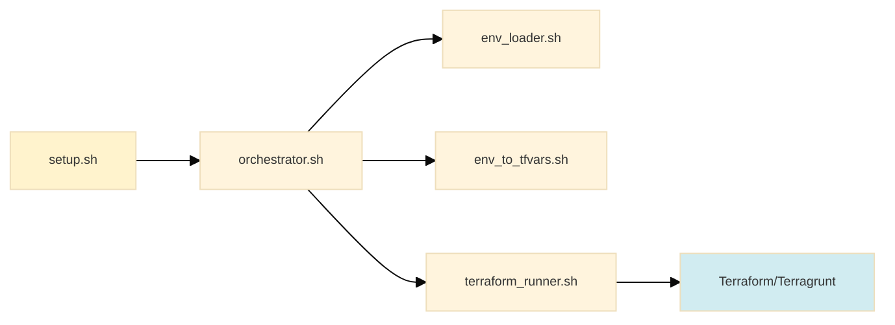

**Key Files:**
- `setup.sh` / `teardown.sh` - Entry points for infrastructure operations
- `lib/orchestrator.sh` - Main orchestration logic
- `lib/env_loader.sh` - Loads `.env` files
- `lib/env_to_tfvars.sh` - Converts env vars to `TF_VAR_*` format
- `lib/terraform_runner.sh` - Executes Terraform/Terragrunt commands

### Layer 2: Provider Modules (`scripts/providers/`)

**Purpose**: Provider-specific implementations

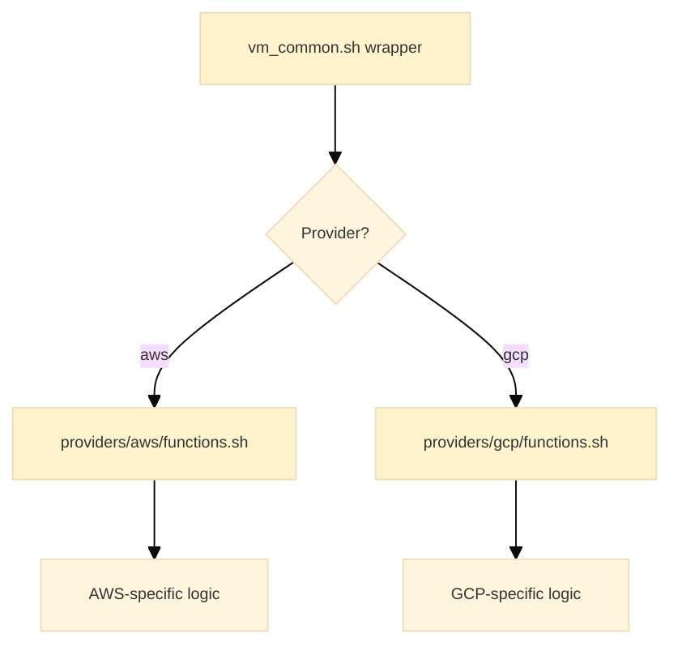

**Structure:**
- `config.sh` - Maps environment variables to Terraform variables
- `constants.sh` - Provider-specific constants (SSH user, key extensions, paths)
- `functions.sh` - Provider-specific functions:
  - `find_vm_ip_{provider}()`
  - `find_ssh_key_{provider}()`
  - `wait_for_instance_{provider}()`
  - `show_access_info_{provider}()`
  - `monitor_installation_{provider}()`
  - `monitor_teardown_{provider}()`
  - `install_post_setup_tools_{provider}()`

### Layer 3: VM Common (`scripts/vm/lifecycle/lib/vm_common.sh`)

**Purpose**: Provider-agnostic wrappers

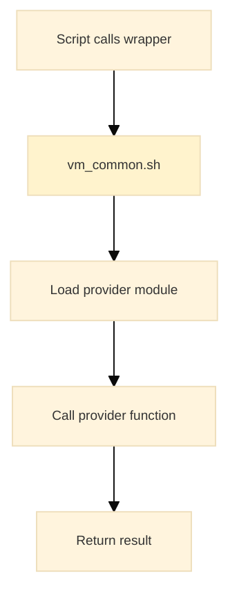

**Functions:**
- `find_vm_ip(provider, root_dir)` → calls `find_vm_ip_{provider}()`
- `find_ssh_key(provider, name_prefix, root_dir)` → calls `find_ssh_key_{provider}()`
- `wait_for_instance(provider, root_dir)` → calls `wait_for_instance_{provider}()`
- `show_access_info(provider, root_dir)` → calls `show_access_info_{provider}()`
- `monitor_installation(provider, instance_id, root_dir)` → calls `monitor_installation_{provider}()`
- `monitor_teardown(provider, instance_id, root_dir)` → calls `monitor_teardown_{provider}()`
- `install_post_setup_tools(provider, root_dir)` → calls `install_post_setup_tools_{provider}()`

### Layer 4: VM Operations (`scripts/vm/`)

**Purpose**: VM lifecycle management

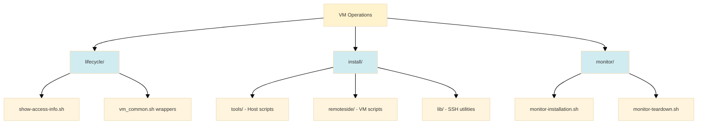

**Components:**

1. **Lifecycle** (`vm/lifecycle/`)
   - `show-access-info.sh` - Displays SSH/RDP connection info
   - Uses `vm_common.sh` wrappers to call provider functions

2. **Install** (`vm/install/`)
   - `tools/*.sh` - Host-side scripts that SSH into VM
   - `remoteside/*.sh` - Scripts executed on the VM
   - `lib/vm_ssh_utils.sh` - SSH utilities (finds IP, key, executes remote scripts)

3. **Monitor** (`vm/monitor/`)
   - `monitor-installation.sh` - Tails cloud-init logs, detects completion
   - `monitor-teardown.sh` - Monitors instance termination
   - Both use `vm_common.sh` wrappers

### Layer 5: Orchestration (`scripts/orchestration/`)

**Purpose**: High-level workflows combining multiple operations

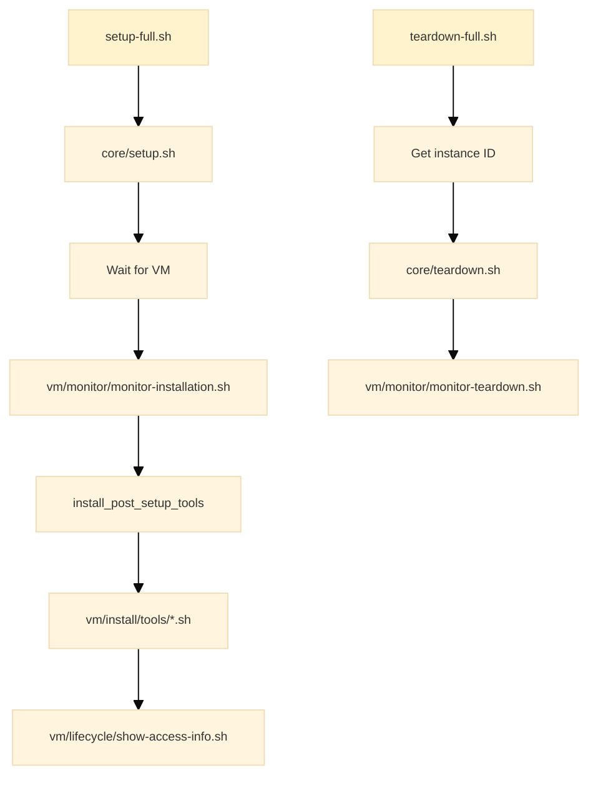

## 🔀 Data Flow

### Environment Variables → Terraform

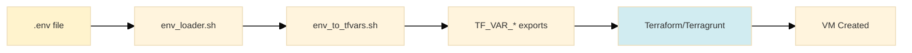

**Process:**
1. `.env` file contains variables like `AWS_PROFILE`, `NAME_PREFIX`, `RDP_PASSWORD`
2. `env_loader.sh` loads and exports variables
3. `env_to_tfvars.sh` converts to `TF_VAR_*` format using provider `config.sh` mappings
4. Terraform/Terragrunt reads `TF_VAR_*` environment variables
5. Infrastructure is provisioned

### Provider Abstraction Flow

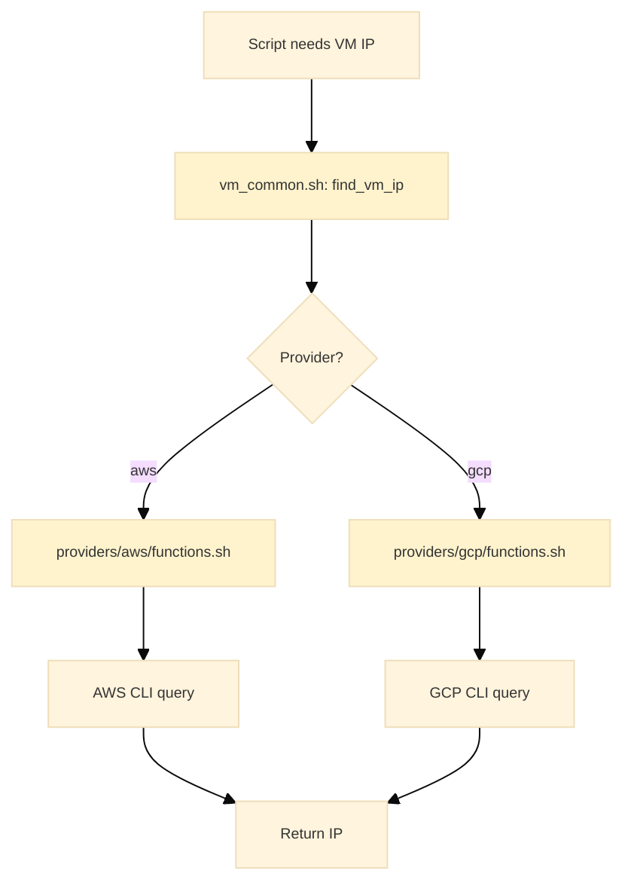

**Benefits:**
- Scripts don't need to know which provider they're using
- Adding a new provider only requires creating 3 files in `providers/{new_provider}/`
- All provider-specific logic is isolated

## 📦 Tool Installation Flow

### Post-Setup Tool Installation

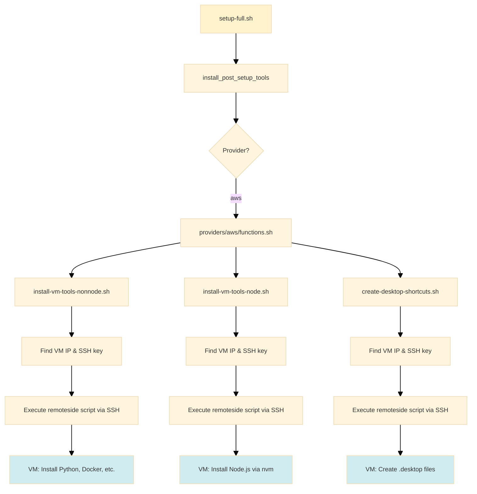

**Components:**
- **Host-side scripts** (`vm/install/tools/*.sh`): Run on your local machine, SSH into VM
- **Remote-side scripts** (`vm/install/remoteside/*.sh`): Executed on the VM via SSH
- **SSH utilities** (`vm/install/lib/vm_ssh_utils.sh`): Finds VM IP, SSH key, executes remote scripts

## 🔍 Key Concepts

### 1. Provider Abstraction

All provider-specific logic is isolated in `providers/{provider}/`. Scripts use generic wrappers from `vm_common.sh` that delegate to provider-specific functions.

**Example:**
```bash
# Script doesn't know if it's AWS or GCP
VM_IP=$(find_vm_ip "${PROVIDER}" "${ROOT_DIR}")

# vm_common.sh loads the right provider and calls:
# - find_vm_ip_aws() for AWS
# - find_vm_ip_gcp() for GCP
```

### 2. Environment Variable Flow

1. `.env` file → `env_loader.sh` → exports variables
2. `env_to_tfvars.sh` → converts to `TF_VAR_*` using provider `config.sh` mappings
3. Terraform/Terragrunt → reads `TF_VAR_*` environment variables

### 3. Separation of Concerns

- **Core** (`scripts/core/`): Infrastructure provisioning/destruction
- **Providers** (`scripts/providers/`): Provider-specific implementations
- **VM** (`scripts/vm/`): VM lifecycle, installation, monitoring
- **Orchestration** (`scripts/orchestration/`): High-level workflows

### 4. Idempotency & Fail-Fast

- All scripts are designed to be safely re-runnable (idempotent)
- Scripts exit immediately on critical errors (fail-fast)
- Installation scripts check if tools are already installed before installing

## 🎯 Common Workflows

### Workflow 1: Full Automated Setup

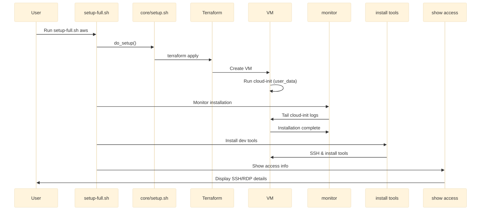

### Workflow 2: Manual Step-by-Step

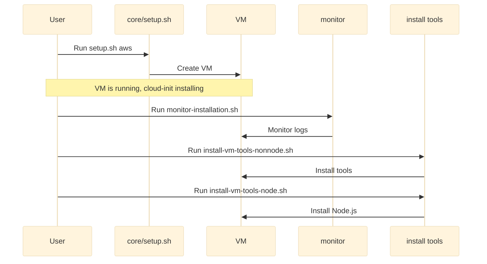

## 📚 File Reference Guide

### Infrastructure Files
- `infra/{provider}/terraform/main.tf` - Terraform resource definitions
- `infra/{provider}/terraform/user_data.sh.tftpl` - VM bootstrap script (executed on VM creation)
- `infra/{provider}/terragrunt/terragrunt.hcl` - Terragrunt configuration

### Script Files by Purpose

| Purpose | Location | Key Files |
|---------|----------|-----------|
| Infrastructure | `scripts/core/` | `setup.sh`, `teardown.sh`, `lib/orchestrator.sh` |
| Provider Logic | `scripts/providers/{provider}/` | `config.sh`, `constants.sh`, `functions.sh` |
| VM Wrappers | `scripts/vm/lifecycle/lib/` | `vm_common.sh` |
| VM Operations | `scripts/vm/lifecycle/` | `show-access-info.sh` |
| Tool Installation | `scripts/vm/install/` | `tools/*.sh`, `remoteside/*.sh` |
| Monitoring | `scripts/vm/monitor/` | `monitor-installation.sh`, `monitor-teardown.sh` |
| Orchestration | `scripts/orchestration/` | `setup-full.sh`, `teardown-full.sh` |
| Utilities | `scripts/tools/env/` | AWS/GCP profile setup, env extraction |

## 🔗 Dependencies

### Script Dependencies

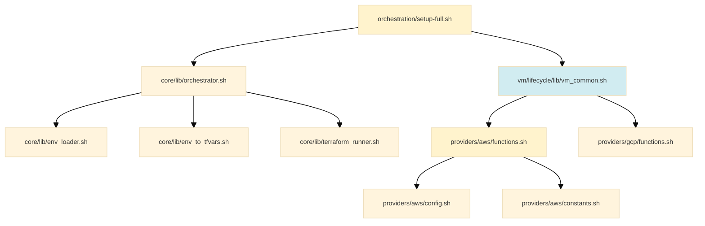

### Library Loading Order

1. `orchestrator.sh` loads core libraries
2. `vm_common.sh` loads provider modules
3. Provider modules load their `config.sh` and `constants.sh`
4. Scripts call wrapper functions from `vm_common.sh`
5. Wrappers delegate to provider-specific functions

## 🎓 Understanding the Codebase

### Where to Start

1. **Entry Points**: Start with `scripts/orchestration/setup-full.sh`
2. **Core Logic**: Follow to `scripts/core/lib/orchestrator.sh`
3. **Provider Abstraction**: See `scripts/vm/lifecycle/lib/vm_common.sh`
4. **Provider Implementation**: Check `scripts/providers/aws/functions.sh`

### Adding a New Provider

1. Create `scripts/providers/{new_provider}/` directory
2. Add `config.sh` (Terraform variable mappings)
3. Add `constants.sh` (provider-specific constants)
4. Add `functions.sh` (implement all required functions)
5. Update `vm_common.sh` to handle new provider in switch statements

### Adding a New VM Operation

1. Add function to `providers/{provider}/functions.sh`
2. Add wrapper to `vm/lifecycle/lib/vm_common.sh`
3. Create script in appropriate `scripts/vm/` subdirectory
4. Update orchestration scripts if needed

---

**See also:**
- [ENTRY_POINTS.md](ENTRY_POINTS.md) - Detailed entry point documentation
- [README.md](README.md) - Quick start guide

